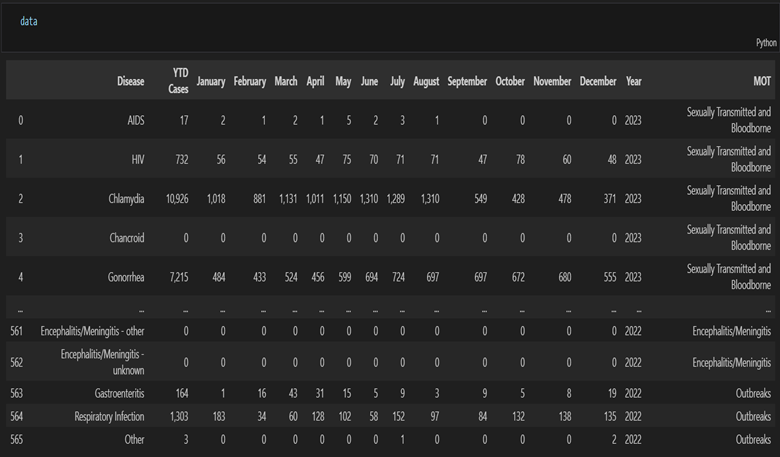
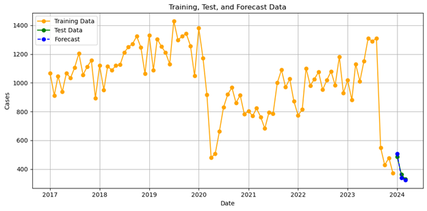
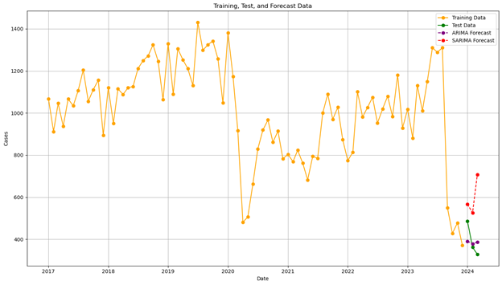
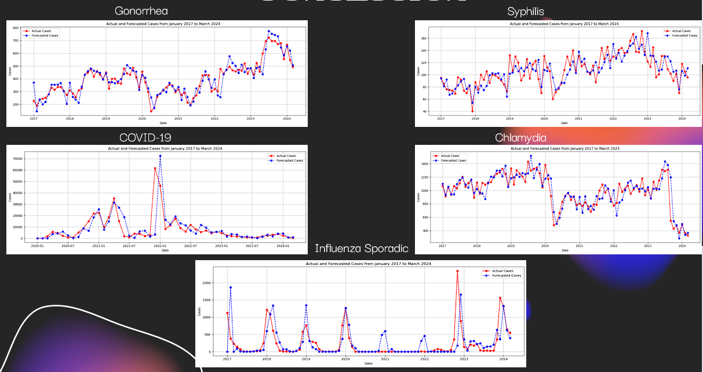
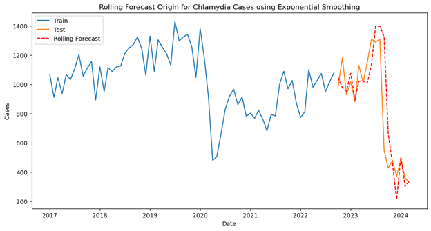

# Forecasting Top 5 Communicable Diseases in Toronto (2024)

## Project Overview
This project uses Exponential Smoothing, ARIMA, and SARIMA models to forecast the number of cases for Toronto's top five communicable diseases for the remainder of 2024. The aim is to enhance public health decision-making through precise forecasting.

## Features
- **Data Preparation**: Includes scripts for data cleaning and preparation.
- **Model Implementation**: Code for Exponential Smoothing, ARIMA, and SARIMA models.
- **Evaluation**: Metrics such as MAE, MSE, and RMSE are used to evaluate model performance.
- **Visualization**: Visualization scripts to display data insights and forecast accuracy.

## How to Use
1. Clone the repo: `git clone https://github.com/yourusername/project-name.git`
2. Install dependencies: `pip install pandas numpy matplotlib statsmodels scikit-learn jupyter`
3. Run the Jupyter notebooks: Navigate to the notebook directory and launch Jupyter Notebook to execute them.

## Screenshots
Here are some visuals from the project:

### Data Sample

### Model Fitting

### Forecast vs Actual Comparison

### Rolling Validation Results

## Dependencies
- Python
- Pandas
- NumPy
- Matplotlib
- Statsmodels
- Scikit-learn

## Contributing
Contributions are welcome! Please fork the project, make your changes, and submit a pull request.

## Author
- Ryan Phil Ancheta

